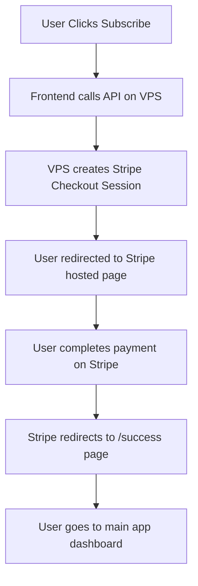

# Homestead Architect Website

Standalone landing page for Homestead Architect - a comprehensive farm management platform with Stripe payment integration.

## Overview

This is a static website version of the Homestead Architect landing page with integrated Stripe checkout for subscription payments. It contains the sales/marketing page with pricing tiers that users see when they visit homesteadarchitect.com.

## Features

- **Responsive Design**: Mobile-first design that works on all devices
- **Modern UI**: Built with Tailwind CSS and shadcn/ui components
- **Stripe Integration**: Secure payment processing with hosted checkout
- **SEO Optimized**: Proper meta tags, semantic HTML, and structured content
- **Performance**: Optimized assets and lazy loading
- **Static Hosting Ready**: Pure HTML/CSS/JS that can be deployed anywhere

## 🚀 Quick Setup

### 1. Stripe Dashboard Setup

1. Go to [Stripe Dashboard](https://dashboard.stripe.com/)
2. Create products and prices:
   - **Basic Plan**: $4.99/month → Create price with ID `price_basic_XXXXX`
   - **Pro Plan**: $19.99/month → Create price with ID `price_pro_XXXXX`

3. Get your API keys:
   - **Publishable key**: `pk_live_...` (for client-side)
   - **Secret key**: `sk_org_live_...` (for server-side, already configured)

### 2. Update Price IDs

Edit `src/lib/stripe.ts` and replace the placeholder price IDs:

```typescript
// Replace these with your actual Stripe price IDs (found in Products → [Product Name] → Pricing)
priceId: 'price_your_actual_stripe_price_id_here', // Basic Plan
priceId: 'price_your_actual_stripe_price_id_here', // Pro Plan
```

### 3. Update Environment Variables

Edit `.env` and add your Stripe publishable key:

```bash
VITE_STRIPE_PUBLISHABLE_KEY=pk_live_your_actual_publishable_key_here
```

### 3. Update Environment Variables

Edit `.env` and add your Stripe publishable key:

```bash
VITE_STRIPE_PUBLISHABLE_KEY=pk_live_your_actual_publishable_key_here
```

## 🏗️ Architecture

### Payment Flow



### Components

- **Pricing Component**: Displays Free, Basic ($4.99), Pro ($19.99) tiers
- **Stripe Integration**: Hosted checkout for secure payments
- **Success/Error Pages**: Handle Stripe redirects
- **Serverless Function**: Creates checkout sessions (deploy separately)

## 🚢 Deployment

### Option 1: Vercel/Netlify (Recommended)

1. **Deploy the website**:
   ```bash
   npm run build
   # Upload dist/ folder to your hosting provider
   ```

2. **Deploy the API**:
   - Copy `api/create-checkout-session.js` to your serverless platform
   - Set environment variable: `STRIPE_SECRET_KEY=your_secret_key`
   - Update the API endpoint URL in `src/lib/stripe.ts`

### Option 2: OVH VPS Deployment

1. **Build the website**:
   ```bash
   npm run build
   ```

2. **Deploy API to OVH VPS**:
   ```bash
   # On your OVH VPS:
   mkdir homestead-api
   cd homestead-api

   # Copy API files from your zip:
   # - api/create-checkout-session.js
   # - deploy-api.js
   # - api/package.json

   # Install dependencies
   npm install

   # Set environment variables
   export STRIPE_SECRET_KEY="sk_org_live_..."
   export PORT=3001

   # Start the API server
   npm start
   ```

3. **Configure Nginx** (on your OVH VPS):
   ```nginx
   # Add to your nginx config
   server {
       listen 80;
       server_name homesteadarchitect.com;

       # API proxy
       location /api/ {
           proxy_pass http://localhost:3001;
           proxy_set_header Host $host;
           proxy_set_header X-Real-IP $remote_addr;
       }

       # Website files
       location / {
           root /path/to/your/website/dist;
           try_files $uri $uri/ /index.html;
       }
   }
   ```

4. **Start API with PM2** (recommended for production):
   ```bash
   npm install -g pm2
   pm2 start deploy-api.js --name homestead-api
   pm2 startup
   pm2 save
   ```

### Option 3: Local Development

```bash
# Install dependencies
npm install

# Start development server
npm run dev

# Test API locally (requires Express)
npm run server  # Runs on port 4242

# Build for production
npm run build

# Preview production build
npm run preview
```

## 📋 Configuration

### Stripe Products Setup

1. **Login to Stripe Dashboard**
2. **Create Products**:
   - Go to Products → Create Product
   - **Basic Plan**: Name, description, pricing $4.99/month
   - **Pro Plan**: Name, description, pricing $19.99/month

3. **Get Price IDs**:
   - Copy the price IDs (format: `price_XXXXXXXXXXXXXXXXXX`)
   - Update `src/lib/stripe.ts` with these IDs

### Environment Variables

```bash
# .env file
VITE_STRIPE_PUBLISHABLE_KEY=pk_live_your_key_here
```

### API Endpoint URL

Update `src/lib/stripe.ts` with your deployed API endpoint:

```typescript
const response = await fetch('/api/create-checkout-session', {
  // Change this to your deployed API URL if needed
  // method: 'POST',
});
```

## 📁 File Structure

```
homestead-architect-website/
├── api/                           # Serverless functions
│   └── create-checkout-session.js # Stripe checkout session creator
├── dist/                          # Built website (upload this to hosting)
│   ├── index.html                # Main HTML file
│   ├── assets/                   # Static assets
├── src/                          # Source code
│   ├── components/
│   │   ├── ui/                  # Reusable UI components
│   │   └── landing/             # Landing page sections
│   │       ├── Pricing.tsx      # Subscription pricing component
│   ├── lib/
│   │   └── stripe.ts            # Stripe configuration & utilities
│   ├── pages/                   # Page components
│   │   ├── Success.tsx          # Payment success page
│   │   └── Error.tsx            # Payment error page
│   ├── App.tsx                  # Main app with routing
│   └── index.css                # Global styles
├── .env                          # Environment variables
└── package.json                 # Dependencies & scripts
```

## 🔧 Customization

### Pricing Changes

Edit `src/lib/stripe.ts` to modify pricing:

```typescript
export const pricingTiers: PricingTier[] = [
  {
    id: 'basic',
    name: 'Basic',
    price: '$4.99/month', // Change price here
    features: [/* Add/remove features */],
    priceId: 'price_your_stripe_price_id', // Update Stripe price ID
  },
  // ... other tiers
];
```

### Styling Changes

Modify design tokens in `src/index.css`:

```css
:root {
  --primary: 145 45% 35%; /* Change brand color */
  --gradient-primary: linear-gradient(135deg, hsl(145 45% 35%), hsl(145 50% 45%));
}
```

### Content Changes

Update text in component files:
- **Navigation**: `src/components/landing/Navigation.tsx`
- **Hero**: `src/components/landing/Hero.tsx`
- **Features**: `src/components/landing/Features.tsx`
- **Pricing**: `src/components/landing/Pricing.tsx`

## 🧪 Testing

### Test Cards

Use these Stripe test cards (only in test mode):

| Scenario | Card Number | Result |
|----------|-------------|---------|
| Success | 4242424242424242 | Payment succeeds |
| Authentication | 4000002500003155 | Requires 3D Secure |
| Decline | 4000000000009995 | Payment declined |

### Local Testing

1. **Start the API server**:
   ```bash
   npm run server
   ```

2. **Start the frontend**:
   ```bash
   npm run dev
   ```

3. **Test checkout flow**:
   - Click "Subscribe" buttons
   - Use test cards
   - Verify success/error redirects

## 🔐 Security Notes

- ✅ **PCI Compliant**: No sensitive payment data touches your servers
- ✅ **Secure**: Stripe handles all payment processing
- ✅ **HTTPS Required**: Stripe checkout requires HTTPS in production
- ⚠️ **Secret Key**: Never expose your Stripe secret key in client-side code

## 🆘 Troubleshooting

### Common Issues

**"Checkout session creation failed"**
- Check your Stripe secret key in the API function
- Verify price IDs are correct
- Ensure API endpoint is accessible

**"Invalid API key"**
- Use live keys in production, test keys for development
- Check key format (pk_live_... for publishable, sk_org_live_... for secret)

**"Price ID not found"**
- Verify price IDs in Stripe Dashboard match your code
- Ensure products are active and prices are created

### Support

- **Stripe Docs**: [checkout.stripe.com](https://docs.stripe.com/checkout)
- **Dashboard**: [dashboard.stripe.com](https://dashboard.stripe.com)
- **Main App**: Check Homestead Architect repository for issues

---

**Built for homesteaders, by homesteaders** 🌱

**Ready to accept payments and grow your homestead planning community!** 🚀